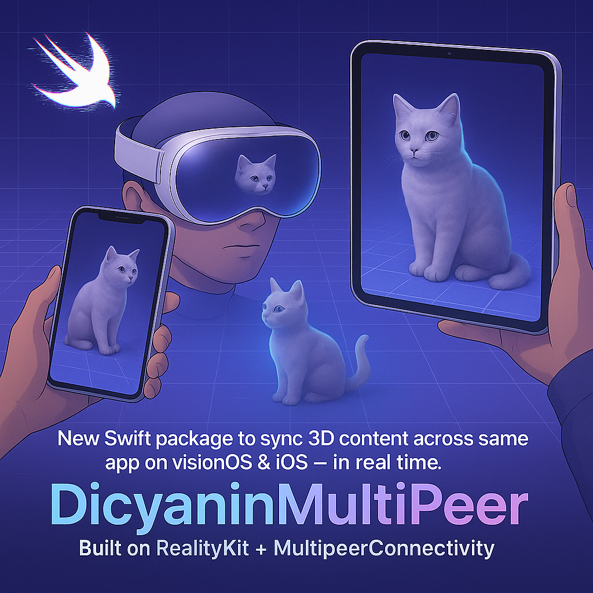
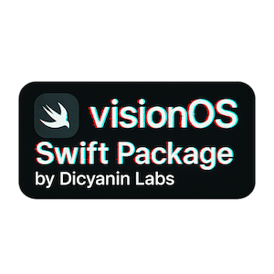

# DicyaninMultiPeer 🎮 🔄 🌐

> Create stunning multi-device AR/VR experiences with ease! This powerful Swift package enables seamless synchronization of 3D content across Apple devices, making it perfect for collaborative AR applications, interactive presentations, and immersive multi-user experiences. Built on top of RealityKit and MultipeerConnectivity, it handles all the complex networking and synchronization logic so you can focus on creating amazing experiences. 🚀

A Swift package for synchronizing 3D content across multiple Apple devices using MultipeerConnectivity framework. This package provides the foundation for creating shared AR/VR experiences between visionOS and iOS devices.

## Example Project

Check out the [example project](https://github.com/hunterh37/DicyaninPackagesExampleProjects/tree/master/DicyaninPlayground005-MultiPeer) to see how to implement multi-device synchronization in your own apps. The example demonstrates:
- Setting up device connections
- Synchronizing 3D models
- Handling real-time interactions
- Managing multi-device state

## Features

- Real-time entity synchronization across devices
- Support for 3D model data transfer
- Automatic device discovery and connection management
- Transform synchronization for interactive objects
- Built on top of RealityKit and MultipeerConnectivity

## Installation

### Swift Package Manager

Add the package to your Xcode project:

1. In Xcode, go to File > Add Packages...
2. Enter the package repository URL
3. Select the version you want to use
4. Click Add Package

## Usage

### Basic Setup

```swift
import DicyaninMultiPeer
import RealityKit

// Create a manager instance
let manager = MultiDeviceManager(displayName: "YourAppName")

// Set up your RealityView
RealityView { content in
    // Create a sync root entity
    let syncRoot = Entity()
    syncRoot.name = "SyncRoot"
    syncRoot.components.set(SyncComponent(id: "SyncRoot"))
    
    // Add your content
    content.add(syncRoot)
    
    // Start observing
    manager.startObserving(rootEntity: syncRoot)
    
    // Set up entity observation
    if manager.entityObservation == nil {
        manager.entityObservation = EntityObservation(
            rootEntity: syncRoot,
            onDataReceived: { data in
                manager.entityObservation?.handleReceivedData(data)
            }
        )
    }
}
```

### Synchronizing Entities

```swift
// Create an entity with sync components
let entity = Entity()
entity.name = "MyEntity"

// Add sync component
let syncId = "Entity_\(UUID().uuidString)"
entity.components.set(SyncComponent(id: syncId))

// Add model sync component if needed
if let modelData = try? Data(contentsOf: modelURL) {
    entity.components.set(SyncModelComponent(modelData: modelData))
}

// Add to your scene
rootEntity.addChild(entity)

// Broadcast updates
if let entityObservation = manager.entityObservation {
    let transform = SyncTransform(from: entity.transform)
    entityObservation.broadcastTransform(for: entity, transform: transform)
}
```

### Synchronizing 3D Models

To synchronize 3D models across devices, use the `configureModelForSync` helper method:

```swift
// Create an entity with a 3D model
let entity = Entity()

// Configure for sync with a model
if let modelURL = Bundle.main.url(forResource: "MyModel", withExtension: "usdz") {
    entity.configureModelForSync(modelURL: modelURL, manager: manager, rootEntity: rootEntity)
}

// For subsequent transform updates, use the helper method
entity.broadcastTransformUpdate(manager: manager)
```

The helper methods handle all the necessary setup:
- Adding sync components
- Loading and configuring the model
- Broadcasting the initial state with model data
- Providing a simple way to broadcast transform updates

### Interactive Transform Updates

Here's a complete example of a RealityView that includes draggable, synchronized entities:

```swift
struct ContentView: View {
    @StateObject private var manager = MultiDeviceManager(displayName: "MyApp")
    
    var body: some View {
        RealityView { content in
            // Create root entity for synchronization
            let rootEntity = Entity()
            rootEntity.name = "SyncRoot"
            content.add(rootEntity)
            
            // Start observing the root entity
            manager.startObserving(rootEntity: rootEntity)
            
            // Create and configure a draggable entity
            if let modelURL = Bundle.main.url(forResource: "MyModel", withExtension: "usdz") {
                let entity = Entity()
                entity.configureModelForSync(modelURL: modelURL, manager: manager, rootEntity: rootEntity)
            }
        } update: { content in
            // Update content if needed
        }
        .gesture(
            DragGesture()
                .targetedToAnyEntity()
                .onChanged { value in
                    if let entity = value.entity {
                        // Update entity position
                        entity.position = value.translation
                        
                        // Broadcast the update to other devices
                        entity.broadcastTransformUpdate(manager: manager)
                    }
                }
        )
        .overlay(alignment: .bottom) {
            MultiDeviceConnectionView(displayName: manager.displayName)
                .background(.ultraThinMaterial)
        }
    }
}
```

This example shows:
- Setting up a synchronized RealityView
- Creating and configuring entities with models
- Handling drag gestures to update positions
- Broadcasting position updates to other devices
- Displaying the connection status

### Connection Management

```swift
// Add the connection view to your SwiftUI view
MultiDeviceConnectionView(displayName: "YourAppName")
    .background(.ultraThinMaterial)

// Monitor connection state
.onChange(of: manager.isConnected) { newValue in
    print("Connection state: \(newValue)")
}
.onChange(of: manager.connectedPeers) { newPeers in
    print("Connected peers: \(newPeers.count)")
}
```

## Components

### MultiDeviceManager

The main class that handles device discovery and connection management.

```swift
class MultiDeviceManager {
    var isConnected: Bool
    var connectedPeers: [MCPeerID]
    var entityObservation: EntityObservation?
    
    func startObserving(rootEntity: Entity)
    func stopObserving()
}
```

### EntityObservation

Manages entity synchronization across devices.

```swift
class EntityObservation {
    func broadcastTransform(for entity: Entity, transform: SyncTransform)
    func handleReceivedData(_ data: Data)
}
```

### SyncComponent

Tracks entity state and updates.

```swift
struct SyncComponent: Component {
    var id: String
    var timestamp: TimeInterval
    var sequenceNumber: Int
}
```

### SyncModelComponent

Handles 3D model data synchronization.

```swift
struct SyncModelComponent: Component {
    var modelURL: URL?
    var modelData: Data?
}
```

## Best Practices

1. **Entity Naming**
   - Use unique names for entities
   - Include UUID in sync IDs to prevent conflicts

2. **Model Synchronization**
   - Always include model data when adding new 3D models
   - Use appropriate collision shapes for interaction

3. **Connection Management**
   - Handle connection state changes appropriately
   - Provide user feedback for connection status

4. **Performance**
   - Only broadcast transform updates when necessary
   - Use appropriate update frequency for your use case

## Info.plist Configuration

To enable MultipeerConnectivity in your app, you must add the following keys to your app's Info.plist file:

```xml
<key>NSLocalNetworkUsageDescription</key>
<string>This app uses the local network to connect and synchronize 3D content with other devices.</string>
<key>NSBonjourServices</key>
<array>
    <string>_your-service-type._tcp</string>
</array>
```

- **NSLocalNetworkUsageDescription**: Explains to users why your app needs access to the local network.
- **NSBonjourServices**: Lists the Bonjour service types your app will use (replace `_your-service-type._tcp` with your actual service type, e.g., `_dicyaninmp._tcp`).

Without these entries, your app will not be able to discover or connect to other devices on the local network.

## Requirements

- iOS 17.0+
- visionOS 1.0+
- Swift 5.9+
- Xcode 15.0+

## License

This package is licensed under the MIT License - see the LICENSE file for details.

## Contributing

Contributions are welcome! Please feel free to submit a Pull Request.

## Author

Hunter Harris
- GitHub: [@hunterh37](https://github.com/hunterh37)
- Website: [dicyaninlabs.com](https://dicyaninlabs.com)

 